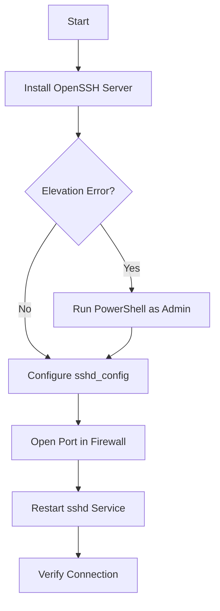

# SSH Practice Log (OpenSSH on Windows)

In this practice we installed and configured an OpenSSH server on Windows Server. Below are the steps performed, the problems encountered and the final configuration.

## 1. Installation Summary

The objective was to enable a secure SSH server to allow remote connections.

### Process Diagram

## 2. Problems Encountered and Solutions

During installation we encountered the following obstacles that we managed to resolve:

### Error 1: Insufficient Permissions

- **Symptom**: When trying to install the service, we received the message _"The requested operation requires elevation"_.
- **Cause**: The terminal did not have administrator permissions.
- **Solution**: We closed the terminal and opened a new instance of **PowerShell with "Run as Administrator"**.

### Error 2: Syntax Error in mkdocs.yml

- **Symptom**: When trying to document the process, `mkdocs serve` failed with an _"expected ':'"_ error.
- **Cause**: There was an indentation error and mixing of configurations in the YAML file.
- **Solution**: We corrected the indentation to ensure keys and values were properly aligned and separated the site configuration logic from the service logic.

## 3. Configuration Applied

Finally, we applied the following custom configuration in the `sshd_config` file:

- **Port**: Changed to **2222** (for security, to avoid the default port 22).
- **Firewall**: An inbound rule was created to allow TCP traffic on port 2222.
- **Service**: Ensured that the `sshd` service starts automatically (`Set-Service -Name sshd -StartupType 'Automatic'`).
