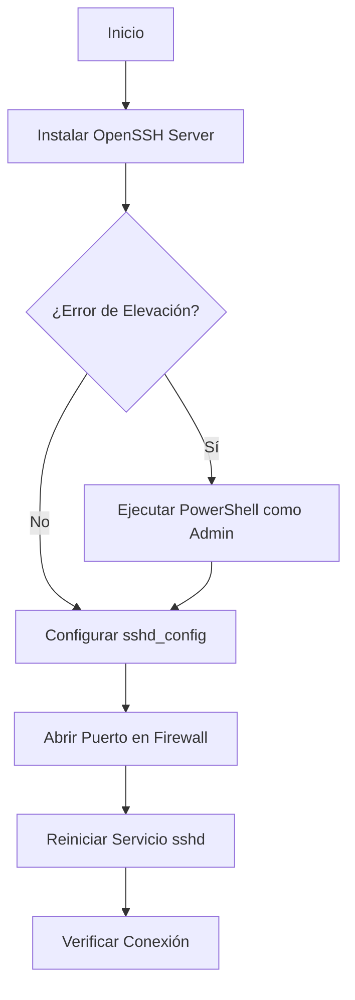

# Bitácora de Práctica SSH (OpenSSH en Windows)

En esta práctica hemos instalado y configurado un servidor OpenSSH en Windows Server. A continuación se detallan los pasos realizados, los problemas encontrados y la configuración final.

## 1. Resumen de la Instalación

El objetivo era habilitar un servidor SSH seguro para permitir conexiones remotas.

### Diagrama del Proceso

## 2. Problemas Encontrados y Soluciones

Durante la instalación nos encontramos con los siguientes obstáculos que logramos resolver:

### Error 1: Permisos Insuficientes

- **Síntoma**: Al intentar instalar el servicio, recibimos el mensaje _"La operación solicitada requiere elevación"_.
- **Causa**: La terminal no tenía permisos de administrador.
- **Solución**: Cerramos la terminal y abrimos una nueva instancia de **PowerShell con "Ejecutar como Administrador"**.

### Error 2: Error de Sintaxis en mkdocs.yml

- **Síntoma**: Al intentar documentar el proceso, `mkdocs serve` falló con un error _"expected ':'"_.
- **Causa**: Había un error de indentación y mezcla de configuraciones en el archivo YAML.
- **Solución**: Corregimos la indentación para asegurar que las claves y valores estuvieran alineados correctamente y separamos la lógica de configuración del sitio de la del servicio.

## 3. Configuración Realizada

Para finalizar, aplicamos la siguiente configuración personalizada en el archivo `sshd_config`:

- **Puerto**: Cambiado al **2222** (por seguridad, para evitar el puerto 22 por defecto).
- **Firewall**: Se creó una regla de entrada para permitir tráfico TCP en el puerto 2222.
- **Servicio**: Se aseguró que el servicio `sshd` inicie automáticamente (`Set-Service -Name sshd -StartupType 'Automatic'`).
