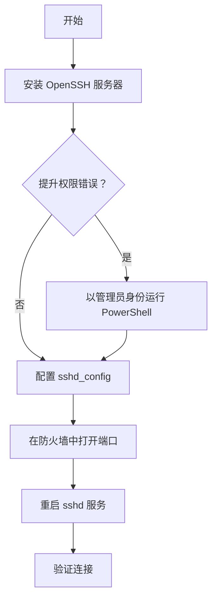

# SSH 实践日志 (Windows 上的 OpenSSH)

在本次实践中，我们在 Windows Server 上安装并配置了 OpenSSH 服务器。以下是执行的步骤、遇到的问题以及最终配置。

## 1. 安装总结

目标是启用安全的 SSH 服务器以允许远程连接。

### 流程图

## 2. 遇到的问题及解决方案

在安装过程中，我们遇到了以下障碍并成功解决：

### 错误 1：权限不足

- **症状**：尝试安装服务时，我们收到消息 _"The requested operation requires elevation"_（请求的操作需要提升权限）。
- **原因**：终端没有管理员权限。
- **解决方案**：我们关闭终端并打开了一个新的 **"以管理员身份运行" 的 PowerShell** 实例。

### 错误 2：mkdocs.yml 中的语法错误

- **症状**：尝试记录过程时，`mkdocs serve` 失败并显示 _"expected ':'"_（预期 ':'）错误。
- **原因**：YAML 文件中存在缩进错误和配置混合。
- **解决方案**：我们更正了缩进以确保键和值正确对齐，并将站点配置逻辑与服务逻辑分开。

## 3. 应用的配置

最后，我们在 `sshd_config` 文件中应用了以下自定义配置：

- **端口**：更改为 **2222**（为了安全，避免使用默认端口 22）。
- **防火墙**：创建了入站规则以允许端口 2222 上的 TCP 流量。
- **服务**：确保 `sshd` 服务自动启动 (`Set-Service -Name sshd -StartupType 'Automatic'`)。
