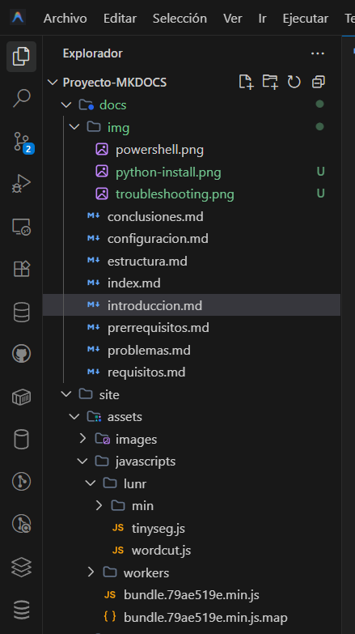

# Project Configuration

Once the tools are installed, it's time to create and configure our MkDocs project. In this section you will learn the file structure and how the main configuration file works.



---

## 1️⃣ Create the Base Project

### Initialize MkDocs

Navigate to your project folder and run the initialization command:

```powershell
cd C:\Users\YourUser\Desktop\ASIR\Project-MKDOCS
mkdocs new .
```

!!! info "What does `mkdocs new .` do?"
This command creates the basic project structure in the current directory (`.`):

    - `mkdocs.yml` - Main configuration file
    - `docs/` - Folder for Markdown files
    - `docs/index.md` - Default home page

### Generated Structure

```
Project-MKDOCS/
├── docs/
│   └── index.md
└── mkdocs.yml
```

---

## 2️⃣ The mkdocs.yml File

The `mkdocs.yml` file is the **heart** of the project. Everything is configured here: the theme, extensions, navigation and site metadata.

### File Anatomy

```yaml title="mkdocs.yml"
# ============================================
# SITE METADATA
# ============================================
site_name: MkDocs Meta-Documentation
site_description: Step by step guide to deploy MkDocs
site_author: ASIR Student

# ============================================
# THEME AND APPEARANCE
# ============================================
theme:
  name: material
  language: en
  palette:
    primary: indigo
    accent: indigo

# ============================================
# MARKDOWN EXTENSIONS
# ============================================
markdown_extensions:
  - admonition
  - pymdownx.details
  - pymdownx.superfences
  - pymdownx.tabbed:
      alternate_style: true
  - pymdownx.highlight:
      anchor_linenums: true

# ============================================
# NAVIGATION
# ============================================
nav:
  - Home: index.md
  - Setup: prerrequisitos.md
  - Configuration: estructura.md
  - Errors: problemas.md
  - Conclusions: conclusiones.md
```

!!! warning "YAML Syntax: Watch the Indentation!"
YAML is very sensitive to spaces. You must use **spaces, never tabs**, and maintain consistent indentation (usually 2 spaces).

    ```yaml
    # ✅ Correct
    theme:
      name: material
      palette:
        primary: indigo

    # ❌ Incorrect (tabs or wrong indentation)
    theme:
    	name: material
       palette:
        primary: indigo
    ```

---

## 3️⃣ Extensions Explained

### Admonitions (Alerts)

Admonitions are colored boxes to highlight important information:

=== "Code"

    ```markdown
    !!! note "Note Title"
        Note content.

    !!! warning "Warning"
        This is important.

    !!! success "Success"
        Everything went well!

    !!! failure "Error"
        Something failed.
    ```

=== "Result"

    !!! note "Note Title"
        Note content.

    !!! warning "Warning"
        This is important.

    !!! success "Success"
        Everything went well!

    !!! failure "Error"
        Something failed.

### Collapsible Blocks

Useful for additional information that not everyone needs to see:

=== "Code"

    ```markdown
    ??? tip "Click to expand"
        This content is hidden by default.

    ???+ note "Expanded by default"
        This block starts open.
    ```

=== "Result"

    ??? tip "Click to expand"
        This content is hidden by default.

    ???+ note "Expanded by default"
        This block starts open.

### Tabs

Perfect for showing alternatives or different operating systems:

=== "Code"

    ```markdown
    === "Windows"
        ```powershell
        pip install mkdocs-material
        ```

    === "Linux/Mac"
        ```bash
        pip3 install mkdocs-material
        ```
    ```

=== "Result"

    === "Windows"
        ```powershell
        pip install mkdocs-material
        ```

    === "Linux/Mac"
        ```bash
        pip3 install mkdocs-material
        ```

---

## 4️⃣ Preview the Site

MkDocs includes a development server that allows you to see changes in real time.

### Start the Server

```powershell
mkdocs serve
```

### Expected Output

```
INFO    -  Building documentation...
INFO    -  Cleaning site directory
INFO    -  Documentation built in 0.50 seconds
INFO    -  [12:30:45] Watching paths for changes: 'docs', 'mkdocs.yml'
INFO    -  [12:30:45] Serving on http://127.0.0.1:8000/
```

!!! success "Server Active!"
Open your browser and navigate to **http://127.0.0.1:8000** to see your site. Any changes you make to the files will be automatically reflected.

### Stop the Server

Press `Ctrl + C` in the terminal to stop the server.

---

## 5️⃣ Add New Pages

To create a new page:

1. Create a `.md` file in the `docs/` folder
2. Add the entry in the `nav` section of `mkdocs.yml`

### Example

```powershell
# Create the file
New-Item -Path .\docs\new-page.md -ItemType File
```

```yaml title="mkdocs.yml"
nav:
  - Home: index.md
  - New Page: new-page.md
```

---

## ✅ Verification

To verify everything is configured correctly:

```powershell
# Validate the configuration
mkdocs build --strict
```

!!! success "Successful Build"
If the command finishes without errors, your configuration is correct and the site is ready to be deployed.

[See the Problems Encountered :material-arrow-right:](problemas.md){ .md-button .md-button--primary }
