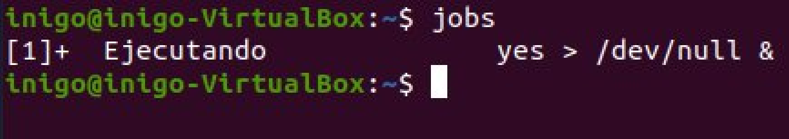
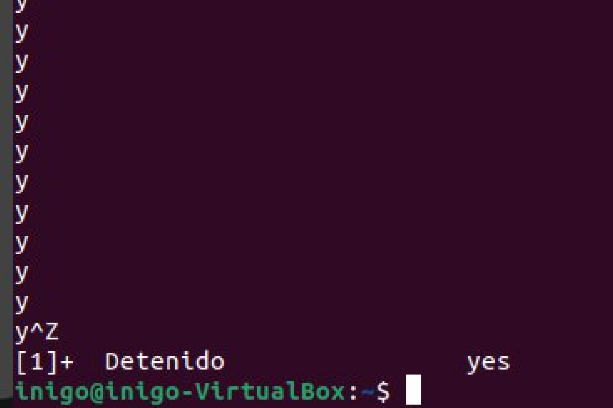
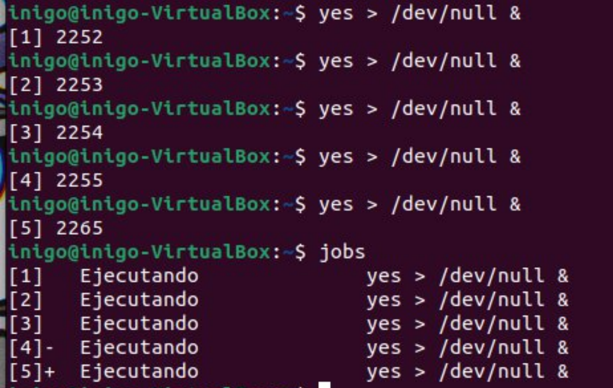
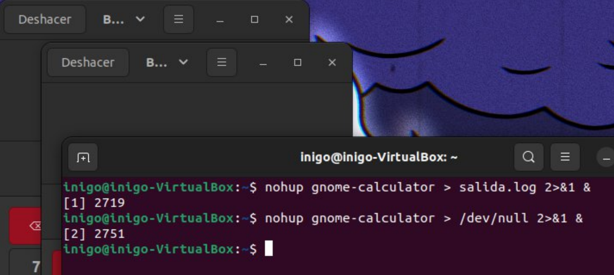

# UNIX: Control de Procesos y Tareas / Tarea Personal

**Autor:** Iñigo Durán Sanz

Esta guía explora el manejo de procesos en sistemas UNIX/Linux, cubriendo desde la ejecución en segundo plano hasta la gestión de prioridades y señales.

---

## Ejercicios Prácticos

### 1. El comando `yes`

El comando `yes` envía una salida infinita de "yes" a la terminal.

- **Observación**: Al ejecutarlo, satura la terminal y "ensucia" la pantalla con texto continuo.

### 2. Interrupción con CTRL+C

Podemos detener la ejecución "agresiva" del comando anterior utilizando la combinación de teclas de interrupción.

### 3. Redirección a `/dev/null`

Ejecutamos `yes > /dev/null`.

- **Resultado**: La pantalla ya no se llena de texto (la salida se descarta), pero la terminal sigue ocupada y no recuperamos el _prompt_.

### 4. Interrupción nuevamente

Cancelamos el proceso anterior con `CTRL+C` para recuperar el control.

### 5. Ejecución en Segundo Plano (`&`)

Ejecutamos `yes > /dev/null &`.

- **Resultado**: El sistema nos devuelve el _prompt_ inmediatamente.
- **Datos**: Obtenemos el **Número de Tarea** y el **PID** (Process ID).

### 6. Estado de Trabajos

Usamos el comando `jobs` para verificar que el proceso sigue corriendo en segundo plano.

### 7. Terminación Normal (`kill`)

Eliminamos el proceso usando el comando `kill %1` (o el número de tarea correspondiente) y verificamos con `jobs`.

### 8. Terminación por PID

Lanzamos de nuevo el proceso y esta vez lo "matamos" usando su **PID** específico: `kill <PID>`.

### 9. Suspender Procesos (`CTRL+Z`)

Lanzamos el proceso en primer plano y lo pausamos/suspendemos con `CTRL+Z`.

### 10. Verificar Suspensión

Comprobamos con `jobs` que el estado es "Stopped" (Detenido).

### 11. Reanudar en Primer Plano (`fg`)

Traemos la tarea suspendida al frente con el comando `fg`.

### 12. Prioridad de Procesos (`nice`/`renice`)

Para ejecutar un proceso con menor prioridad (valor nice más alto, ej. 10), usamos `nice`. Para cambiarla en ejecución, `renice`.

- _Nota: `-10` suele requerir privilegios de root para aumentar prioridad._

### 13. Suspender nuevamente

Detenemos la ejecución temporalmente con `CTRL+Z`.

### 14. Reanudar en Segundo Plano (`bg`)

Reactivamos el proceso pero lo mantenemos en segundo plano ("Background") con `bg`.

### 15. Gestión de Múltiples Procesos

Repetimos la gestión (suspender, `bg`, `fg`) utilizando comandos como `sleep 1000` para tener varios procesos simples.

### 16. Demostración Compleja

Escenario con al menos 5 procesos simultáneos: suspendiendo, reanudando y enviando señales a varios de ellos.

### 17. Visualización Interactiva (`top` / `htop`)

Uso de herramientas interactivas para ver el consumo de recursos en tiempo real.

### 18. Comando `ps` y sus variantes

Uso del comando `ps` con varias combinaciones diferentes para filtrar y formatear la salida:

??? "Comandos ps"

    **Ejemplos:**

    1.  `ps`
    2.  `ps aux`
    3.  `ps -ef`
    4.  `ps -ejH`
    5.  `ps -t`
    6.  `ps -ax --forest`
    7.  `ps -e -o`
    8.  `ps -eo`

### 19. Comando `pstree`

Visualización del árbol de procesos para entender la jerarquía padre-hijo.

### 20. Procesos Hijos y Terminal (`gnome-calculator`)

Al lanzar `gnome-calculator` desde la terminal y cerrar esta última, la calculadora se cierra.

- **Razón**: La calculadora es un proceso hijo de la shell; al morir el padre, mueren los hijos (SIGHUP).

### 21. Uso de `nohup`

Ejecutar `nohup gnome-calculator`. Al cerrar la terminal, la calculadora **sigue abierta**.

- **Razón**: `nohup` ignora la señal de colgar (HUP).

### 22. Independencia total

Con `nohup`, cerrar la aplicación (calculadora) no afecta a la terminal, y cerrar la terminal no afecta a la aplicación. Son independientes.

### 23. Redirección de Salida `nohup`

Para evitar el archivo `nohup.out` por defecto y descartar la salida:
`nohup gnome-calculator > /dev/null 2>&1 &`
Esto redirige tanto la salida estándar como la de error a la "nada".

