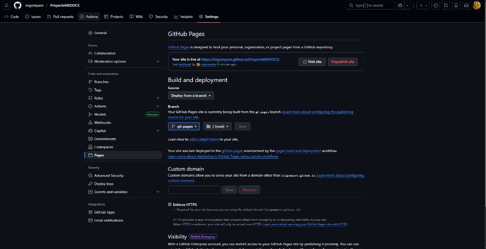

# Troubleshooting: Errores y Soluciones

Esta es la sección más importante de la documentación. Aquí documento **los errores reales** que encontré durante el desarrollo del proyecto y cómo los solucioné. Aprender de los errores es fundamental en la administración de sistemas.


---

## 🔴 Problema 1: Permisos de PowerShell

### Descripción del Error

Al intentar instalar paquetes con `pip` o ejecutar ciertos comandos de administración, PowerShell mostraba el siguiente error:

!!! failure "Error: La operación solicitada requiere elevación"

````
ERROR: Could not install packages due to an OSError: [WinError 5]
Acceso denegado: 'C:\Program Files\Python312\Lib\site-packages\...'

    Consider using the `--user` option or check the permissions.
    ```

    O bien el mensaje más directo:

    ```
    La operación solicitada requiere elevación.
    ```

### Análisis del Problema

Este error ocurre porque Windows protege las carpetas del sistema (como `C:\Program Files\`) y requiere **permisos de
administrador** para modificarlas. Al instalar paquetes de Python de forma global, `pip` intenta escribir en estas carpetas
protegidas.

### Solución

!!! success "Solución: Ejecutar PowerShell como Administrador"
**Opción A: Abrir terminal con permisos elevados**

    1. Busca "PowerShell" en el menú de inicio
    2. Haz clic derecho → **Ejecutar como administrador**
    3. Confirma el diálogo de UAC (Control de Cuentas de Usuario)
    4. Ejecuta el comando que falló anteriormente

    

=== "Opción B: Instalación por Usuario"

    Si no tienes permisos de administrador, puedes instalar paquetes solo para tu usuario:

    ```powershell
    pip install --user mkdocs-material
    ```

    ⚠️ Nota: Esta opción puede causar problemas con el PATH.

=== "Opción C: Entorno Virtual"

    La opción más limpia es usar un entorno virtual de Python:

    ```powershell
    # Crear el entorno virtual
    python -m venv venv

    # Activar el entorno
    .\venv\Scripts\Activate

    # Instalar dentro del entorno
    pip install mkdocs-material
    ```

??? tip "Consejo para VS Code"
Si usas VS Code, puedes configurar el terminal integrado para que abra PowerShell con permisos de administrador por defecto. Sin
embargo, esto no es recomendable por seguridad. Es mejor abrir una terminal externa cuando necesites permisos elevados.

---

## 🔴 Problema 2: Error de Sintaxis YAML

### Descripción del Error

Al ejecutar `mkdocs serve`, el sistema mostraba un error de parsing en el archivo de configuración:

!!! failure "Error: YAML Syntax Error"
`     ERROR   -  Config file 'mkdocs.yml' could not be loaded:
               while parsing a block mapping
               expected <block end>, but found '<scalar>'
               in "mkdocs.yml", line 35, column 1
               could not find expected ':'
    `

### Análisis del Problema

Revisando el archivo `mkdocs.yml`, descubrí que había cometido un error grave: **había
mezclado comandos de SSH y configuración
YAML en el mismo archivo**. Además, la indentación era inconsistente.

El archivo corrupto se veía así:

```yaml title="❌ mkdocs.yml (INCORRECTO)"
site_name: Mi Proyecto
theme:
  name: material

# Generar clave SSH (ESTO NO VA AQUÍ)
ssh-keygen -t rsa -b 4096

nav:
- Inicio: index.md
   - Página 2: pagina2.md  # Indentación incorrecta
````

### Solución

!!! success "Solución: Limpiar y Formatear Correctamente"
El archivo YAML debe contener **solo configuración**, no comandos. Además, la indentación debe ser consistente.

    ```yaml title="✅ mkdocs.yml (CORRECTO)"
    site_name: Mi Proyecto

    theme:
      name: material
      palette:
        primary: indigo

    nav:
      - Inicio: index.md
      - Página 2: pagina2.md
    ```

### Reglas de Oro para YAML

| Regla                                            | Ejemplo Correcto               | Ejemplo Incorrecto               |
| ------------------------------------------------ | ------------------------------ | -------------------------------- |
| Usar espacios, no tabs                           | `  name: valor`                | `→ name: valor`                  |
| Indentación de 2 espacios                        | `theme:`<br>`  name: material` | `theme:`<br>`    name: material` |
| Listas con guión y espacio                       | `- item`                       | `-item`                          |
| Strings con caracteres especiales entre comillas | `title: "Hola: Mundo"`         | `title: Hola: Mundo`             |

??? warning "Cómo Detectar Tabuladores Invisibles"

    En VS Code, puedes visualizar los caracteres invisibles:

    1. Abre la paleta de comandos (`Ctrl + Shift + P`)
    2. Busca "Toggle Render Whitespace"
    3. Los espacios aparecerán como puntos (·) y los tabs como flechas (→)

    También puedes configurar VS Code para convertir tabs a espacios automáticamente en archivos YAML.

---

## 🔴 Problema 3: Despliegue Incompleto en GitHub Pages

### Descripción del Error

Después de ejecutar `mkdocs gh-deploy`, la página de GitHub Pages mostraba un **error 404** o no se actualizaba con los últimos cambios.

!!! failure "Error: Página No Encontrada (404)"
Al acceder a `https://tu-usuario.github.io/Proyecto-MKDOCS/` aparecía:

    > **404 - There isn't a GitHub Pages site here.**

### Posibles Causas y Soluciones

=== "Causa 1: Rama Incorrecta"

    GitHub Pages puede estar configurado para servir desde la rama equivocada.

    **Verificar:**
    ```powershell
    git branch -a
    ```

    **Solución:**

    1. Ve a tu repositorio en GitHub
    2. Settings → Pages
    3. Asegúrate de que Source está en `gh-pages` y `/root`

    

=== "Causa 2: Caché del Navegador"

    A veces el navegador cachea la página 404.

    **Solución:**

    - Haz un hard refresh: `Ctrl + Shift + R`
    - O abre en una ventana de incógnito
    - Espera 2-3 minutos (GitHub Pages puede tardar en propagar)

=== "Causa 3: Despliegue No Completado"

    El comando `gh-deploy` puede haber fallado silenciosamente.

    **Verificar:**
    ```powershell
    # Ver el último despliegue
    git log gh-pages -1
    ```

    **Solución:**
    Vuelve a desplegar forzando la actualización:
    ```powershell
    mkdocs gh-deploy --force
    ```

### Comando de Despliegue Correcto

```powershell
# Asegúrate de estar en la rama main con cambios commiteados
git add .
git commit -m "Actualizar documentación"
git push origin main

# Desplegar a GitHub Pages
mkdocs gh-deploy
```

!!! success "Despliegue Exitoso"
`     INFO    -  Cleaning site directory
    INFO    -  Building documentation to directory: site
    INFO    -  Documentation built in 0.82 seconds
    INFO    -  Copying 'site' to 'gh-pages' branch and pushing to GitHub.
    INFO    -  Your documentation should shortly be available at:
               https://tu-usuario.github.io/Proyecto-MKDOCS/
    `

---

## 🟡 Problema 4: Contenido Vacío o Incompleto

### Descripción del Problema

Inicialmente, los archivos `.md` estaban prácticamente vacíos o solo contenían texto plano sin formato. El resultado era una web funcional pero visualmente pobre.

### Análisis

El problema era la falta de conocimiento sobre las capacidades de **Material for MkDocs**. No estaba aprovechando:

- Admonitions (alertas de colores)
- Bloques de código con resaltado de sintaxis
- Pestañas
- Bloques desplegables
- Tablas
- Emojis e iconos

### Solución

!!! success "Aprender la Sintaxis Extendida de Markdown"
Material for MkDocs extiende Markdown con muchas funcionalidades extra. La clave está en:

    1. **Leer la documentación oficial**: [squidfunk.github.io/mkdocs-material](https://squidfunk.github.io/mkdocs-material/)
    2. **Activar las extensiones** en `mkdocs.yml`
    3. **Practicar** con cada tipo de elemento

??? example "Cheatsheet de Sintaxis"

    **Alertas:**
        `markdown
        !!! note "Título"
        Contenido
    `

    **Código con título:**
        ```markdown
        ```python title="ejemplo.py"
        print("Hola Mundo")
        ```
        ```

    **Pestañas:**
        ```markdown
        === "Pestaña 1"
        Contenido 1

        === "Pestaña 2"
            Contenido 2
        ```

    **Desplegable:**
        ```markdown
        ??? tip "Click para ver más"
            Contenido oculto
        ```

---

## ✅ Lecciones Aprendidas

!!! quote "Reflexión Final"
Cada error fue una oportunidad de aprendizaje. Los problemas más frustrantes enseñaron las lecciones más valiosas:

    - **Permisos**: Siempre verifica que tienes los permisos necesarios antes de ejecutar comandos
    - **Sintaxis**: YAML es muy exigente con el formato; usa un validador o un editor con resaltado
    - **Despliegue**: Lee los logs completos, no solo el mensaje de error
    - **Documentación**: Dedica tiempo a aprender las herramientas que usas

[Ir a las Conclusiones :material-arrow-right:](conclusiones.md){ .md-button .md-button--primary }
